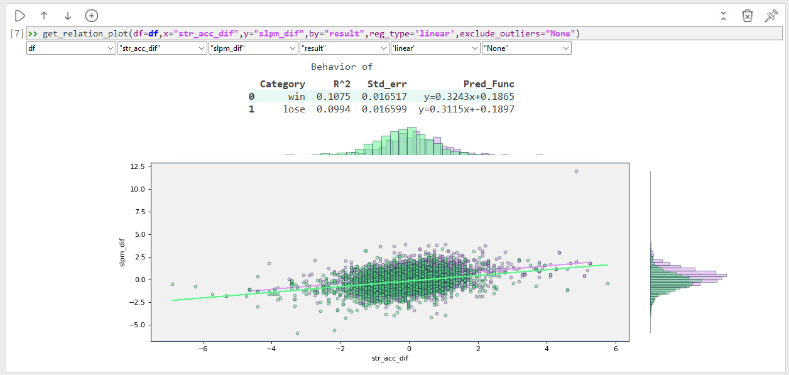

# Data_Explorer App
simple & fast EDA (Exploration Data Analysis) tool, 
App is built on simple building code blocks - each block contain an analysis
that is required for data exploration.

# File Explore screen:

# Next step:
Help me improve,
see anything missing?
think that some function/code block might be helpful to you?
leave a comment 

