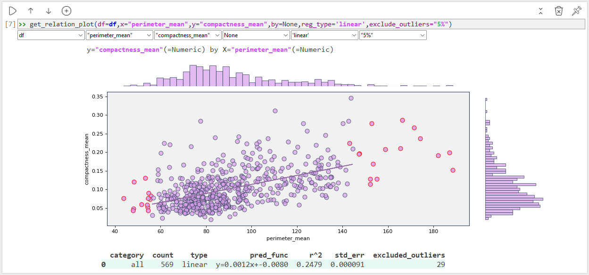

# Data_Explorer App
simple & fast EDA (Exploration Data Analysis) tool, 

it allows you to explore data along many files.

App is built on simple building code blocks - each block contain an analysis

that is required for understanding the data.

# Data File Overview code blocks:

# Visualization code blocks:
### get_dist_plot() : 
Explore Numeric values distribution with verious outliers options:

### get_relation_plot() : 
exploring relation between 2 numeric columns:
* include all data points (=no outliers):

* include only inlier data points (= outliers excluded based on [LocalOutlierFactor](https://scikit-learn.org/1.5/modules/generated/sklearn.neighbors.LocalOutlierFactor.html) density value):

* break the data to categories:

# Visualization/Tabular code blocks:
  ## get_corralations() : 
  can be shown in tabular/chart - allows an overview of linear correlation magnitude(=r^2)
  

# Contact me:
Help me improve,

see anything missing?

think that some function/code block might be helpful to you?

leave a comment 

